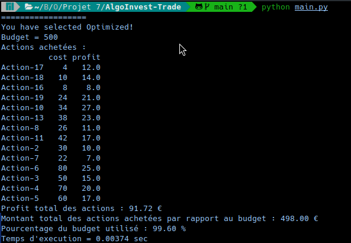
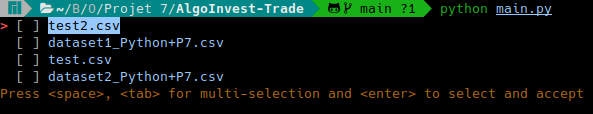
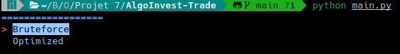

# **AlgoInvest&Trade**


Project 7 # Résolvez des problèmes en utilisant des algorithmes en Python




## Objective:
Vous venez de rejoindre **AlgoInvest&Trade**, une société financière spécialisée dans l'investissement. La société cherche à optimiser ses stratégies d'investissement à l'aide d'algorithmes, afin de dégager davantage de bénéfices pour ses clients.


À ce stade du parcours, vous avez déjà une solide base en développement d’applications avec Python.


Ce projet s'appuie sur les compétences acquises dans les projets précédents. Vous allez consolider votre compréhension **des algorithmes**, et apprendrez à utiliser la **notation Big O**, outil essentiel pour évaluer et améliorer l'efficacité de votre code.

Vous allez décomposer des problèmes complexes et créer des algorithmes efficaces pour concevoir des solutions adaptées .


Au fil du projet, vous allez :

- Trouver une solution “brute-force”.
- Optimiser cette solution en utilisant des algorithmes efficaces.
- Backtester votre code pour vous assurer que votre optimisation est efficace et fiable.

## Requirements

### Venv
-for windows:
```python
c:\>python -m venv
c:\path\to\AlgoInvest-Trade
```
-for linux:
```python
python -m venv /path/to/AlgoInvest-Trade
```

### Souce activate
-for windows:
```python
c:\>path\to\AlgoInvest-Trade\Scripts\activate.bat
```
-for linux:
```python
source /path/to/AlgoInvest-Trade/bin/activate
```

### install requirements
```python
pip install -r requirements.txt
```
if you are this error (i use manjaro):
```python
error: externally-managed-environment

× This environment is externally managed
╰─> To install Python packages system-wide, try "pacman -S
    python-xyz", where xyz is the package you are trying to
    install.

```

try with this command:

```python
pip install -r requirements.txt --break-system-packages
```


## Usage

lancer python.py
```bash
python python.py
```
### Menu principal




Depuis ce menu vous pouvez sélectionner le dataset de votre choix avec la barre espace puis vous pouvez à votre guise choisir d'utiliser soit la version brutforce soit la version optimiser :)

